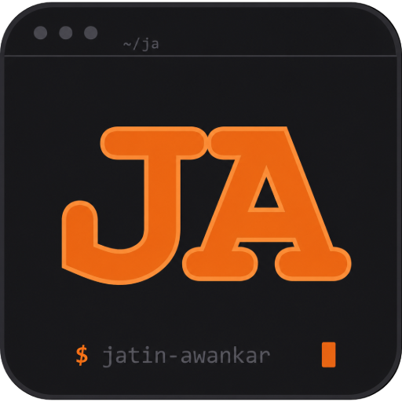

<div align="center">



# Jatin Awankar — Portfolio

**Full-Stack SaaS & MVP Developer**

_Scalable backend systems · Real-time features · Production-ready architecture_

[](https://jatinawankar.dev)
[](https://jatinawankar.dev/Jatin_Awankar_Resume.pdf)
[](https://www.linkedin.com/in/jatin-awankar)
[](https://x.com/awankar_jay)
[](mailto:jatinawankar02@gmail.com)


</div>

---

## Overview

Personal portfolio built around a **terminal/tiling-window metaphor** — every section is a "pane" styled like an editor window, navigation uses filesystem paths (`/home`, `/projects`, `/about`, `/writings`), and a fully functional floating terminal widget lets visitors `cd`, `ls`, `neofetch`, and `open` projects without touching the mouse.

Live GitHub contribution graph, dynamic Medium RSS feed, and open-source PR history are all fetched at build time via ISR — no stale data, no manual updates.

---

## Stack

| Layer      | Technology                                          |
| ---------- | --------------------------------------------------- |
| Framework  | Next.js 15 (App Router)                             |
| Language   | TypeScript                                          |
| Styling    | Tailwind CSS — zinc-950 / orange-400 palette        |
| Fonts      | Inter (body) · JetBrains Mono (display/mono)        |
| Analytics  | Vercel Analytics                                    |
| Data       | GitHub GraphQL API · GitHub Search API · Medium RSS |
| Deployment | Vercel (ISR, hourly revalidation)                   |

---

## Pages

```
/              → Homepage — hero, featured projects, capabilities, open source, contact
/projects      → Case studies — README, git log, stack, demo access per project
/about         → Bio, GitHub contribution graph, achievement badges, PR history
/writings      → Live Medium RSS feed — all published posts
```

---

## Terminal Commands

The floating terminal (bottom-right `>_` button) supports:

```bash
help                  # list all commands
whoami                # who am I?
neofetch              # system info
ls                    # list current directory
cd <page>             # navigate — home, projects, about, writings
open <project>        # scroll to project case study
cat about.md          # short bio
cat resume            # open resume PDF
github                # GitHub stats
blog                  # list writings
projects              # list all projects
contact               # contact info
sudo <anything>       # try it
clear                 # clear the terminal
```

---

## Features

- **Functional floating terminal** — draggable, real commands, real routing via `next/navigation`
- **Custom context menu** — right-click anywhere for terminal-styled quick nav
- **Live GitHub data** — contribution heatmap (GraphQL), open-source PRs (Search API), achievement badges
- **Live writings** — Medium RSS parsed via `rss-parser`, ISR revalidated hourly
- **Demo access** — each project has a `$ cat .env.demo` dialog with credentials
- **Sound effects** — subtle mechanical keyclick + command-execute tones in the terminal (Web Audio API, respects `prefers-reduced-motion`)
- **Path-style navigation** — StatusBar shows `~/jatin-awankar/portfolio/<page>` with live IST clock
- **Fully typed** — TypeScript throughout, no `any`

---

## Project Structure

```
app/
├── page.tsx                    # Homepage
├── projects/page.tsx           # Projects case studies
├── about/page.tsx              # About + GitHub activity
├── writings/page.tsx           # Medium writings
└── layout.tsx                  # Shell: StatusBar, FloatingTerminal, ContextMenu

components/portfolio/
├── StatusBar.tsx               # Path-style nav + live clock
├── FloatingTerminal.tsx        # Draggable terminal widget
├── ContextMenu.tsx             # Custom right-click menu
├── TerminalDataProvider.tsx    # Context for terminal data
├── LiveClock.tsx               # "use client" IST clock
├── home/                       # Homepage section components
├── projects/                   # Project pane + demo dialog
├── about/                      # Bio, GitHub activity, contribution graph
└── writings/                   # Post card + writings pane

lib/
├── github.ts                   # GitHub GraphQL + Search API
├── medium.ts                   # Medium RSS feed
├── sounds.ts                   # Web Audio API sound effects
├── portfolio-data.ts           # Page definitions
└── data/
    └── projects.ts             # Project data (slug, stack, log, demo)
```

---

## Open Source

Contributions that went into building this:

| PR                                                            | Repository              | Status       |
| ------------------------------------------------------------- | ----------------------- | ------------ |
| [#2261](https://github.com/openstatusHQ/openstatus/pull/2261) | openstatusHQ/openstatus | ✅ Merged    |
| [#2276](https://github.com/openstatusHQ/openstatus/pull/2276) | openstatusHQ/openstatus | 🔄 In review |

---

## Writings

All posts at [medium.com/@jatinawankar02](https://medium.com/@jatinawankar02):

- [Why I Moved from Next.js API Routes to a Dedicated Node.js Backend](https://medium.com/backenders-club/why-i-moved-from-next-js-api-routes-to-a-dedicated-node-js-backend-13739c61dd68)
- [Designing Backend Systems That Survive Concurrency, Retries, and Real-World Failures](https://medium.com/@jatinawankar02/designing-backend-systems-that-survive-concurrency-retries-and-real-world-failures-a0a3bba9323b)
- [Designing Payment Systems That Survive Retries, Crashes, and Race Conditions](https://medium.com/@jatinawankar02/designing-payment-systems-that-survive-retries-crashes-and-race-conditions-be9718de5654)
- [What Actually Breaks in Real-World Payment Systems](https://medium.com/@jatinawankar02/what-actually-breaks-in-real-world-payment-systems-and-how-to-design-for-it-fb5138a4fcf6)
- [Preventing Double Booking: Understanding Race Conditions in Real Systems](https://medium.com/@jatinawankar02/preventing-double-booking-understanding-race-conditions-in-real-systems-76e92094dee8)

---

<div align="center">

Built with Next.js, Tailwind CSS, and a terminal you can't quit.

[](https://jatinawankar.dev)

</div>

